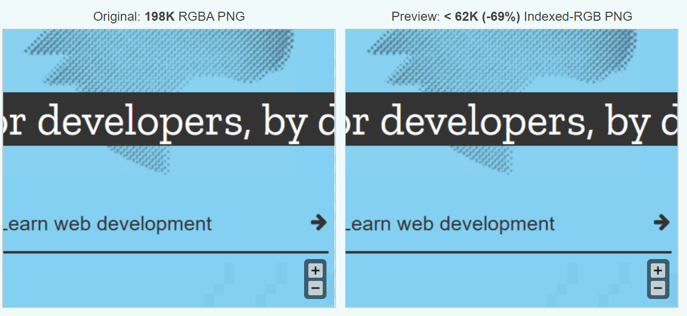

**Lossy compression**, or irreversible compression, is a data-compression method that uses inexact approximations and partial-data discarding to represent content. In simpler terms: lossy compression causes data from the initial file to be lost, possibly causing degradation in quality. The process of such compression is irreversible; once lossy compression of the content has been performed, the content cannot be restored to its original state. Therefore, content that has undergone lossy compression should generally not be further edited.

Lossy compression is widely used in image formats such as {{glossary("JPEG")}}, {{glossary("WebP")}}, and audio and video formats such as [MP3, MP4, H.264 and others](/Web/HTTP/Basics_of_HTTP/MIME_types/Common_types).
Compression methods such as {{glossary("WebP")}} are capable of [both lossy and lossless compression](https://developers.google.com/speed/webp/docs/compression) depending on the compression level or the options you want to use during encoding.

Although there is no obvious difference in quality between the two images above, the size of the second image has been significantly reduced using lossy compression.

## See also

- Related glossary terms:
  - {{Glossary("Lossless compression")}}
