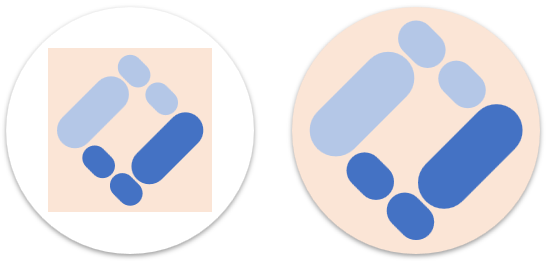
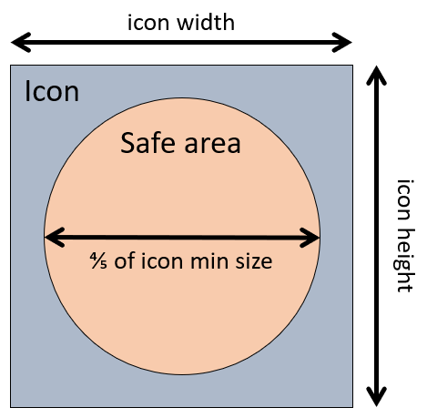

[Progressive Web Apps (PWAs)](/Web/Progressive_web_apps) can be installed on devices just like other apps. Once a PWA is installed, its app icon appears on the device's home screen, dock, taskbar, or any other place where operating system native apps normally appear.

For example, on Windows, the taskbar can contain icons for both native and PWA apps side by side:


When creating a PWA, you can define your own set of icons to be used when the app is installed on a device. This article explains how to define your own app icons, which icon sizes to create, and how to make your icons support masking.

> [!NOTE]
> The PWA app icon is not the same as the {{glossary("favicon")}} image, which is displayed in places like the browser's address bar. PWAs can have both a favicon and an app icon. To learn more about favicons, see [Adding custom icons to your site](/Learn/HTML/Introduction_to_HTML/The_head_metadata_in_HTML#adding_custom_icons_to_your_site).

## Design your icon

The first step in defining your app icon is to design it.

Most users recognize applications by their icons. Icons appear in many places through the operating system, including the home screen, taskbar, app launcher, or setting panels. Make sure your users can easily find your app by making its icon both visually appealing, and representative of your application.

The image should have a transparent background so it can be displayed on a variety of backgrounds. It should be at least 1024x1024 pixels, or scalable to that size, as this is the largest size your icon may be displayed at. You may also want to create icon versions with fewer details, to be used in places where the icon is displayed at smaller sizes.

Designing your icon as an SVG file is a good idea, as this will allow it to be scaled to any size without loss of quality.

## Reference your icons in the web app manifest

Use the [`icons`](/Web/Manifest/icons) web app manifest member to define a set of icons for your PWA.

As described in [Create the necessary icon sizes](#create_the_necessary_icon_sizes), you should create multiple versions of your icon to ensure it appears correctly in all the places where it's used. This is why the `icons` member is an array of objects, each of which represents an icon, with its own size, type, and purpose. Each icon object has the following properties:

- `src`
  - : The URL of the icon image file.
- `sizes`
  - : The sizes the icon can be used for.
- `type`
  - : The {{Glossary("MIME type")}} of the image file which the operating system can use to quickly ignore images it does not support.
- `purpose`
  - : The OS-specific purpose of the image.

For example, the following web app manifest defines five PNG icons, each with a different size:

```json
{
  "name": "My PWA",
  "start_url": "/",
  "display": "standalone",
  "icons": [
    {
      "src": "icon-72.png",
      "sizes": "72x72",
      "type": "image/png"
    },
    {
      "src": "icon-128.png",
      "sizes": "128x128",
      "type": "image/png"
    },
    {
      "src": "icon-144.png",
      "sizes": "144x144",
      "type": "image/png"
    },
    {
      "src": "icon-192.png",
      "sizes": "192x192",
      "type": "image/png"
    },
    {
      "src": "icon-512.png",
      "sizes": "512x512",
      "type": "image/png"
    }
  ]
}
```

## Create the necessary icon sizes

Various operating systems use different icon sizes in different places and for different device capabilities. It's important to create multiple versions of your icon so it appears correctly in all the places where it's used.

For example, Windows can display your app icon as a 44x44 pixels image in the taskbar, or as a 150x150 pixels image in the start menu. Use the links below for more information about the icon sizes used by different operating systems and tips for creating effective icons:

- For Windows, see [Define icons and a theme color](https://learn.microsoft.com/en-us/microsoft-edge/progressive-web-apps-chromium/how-to/icon-theme-color) on learn.microsoft.com.
- For Android, see [Google Play icon design specifications](https://developer.android.com/distribute/google-play/resources/icon-design-specifications) on developer.android.com.
- For iOS and macOS, see [App icons](https://developer.apple.com/design/human-interface-guidelines/app-icons#App-icon-sizes) on developer.apple.com.

The sizes at which your icon is displayed depend on the operating system and may change over time. It's best to test your icon on all the devices and operating systems you want to support, and generate the sizes and image types that lead to the best results. You can also use a tool like [PWA Image Generator](https://www.pwabuilder.com/imageGenerator) to generate the necessary icon sizes for you from a single high-definition image.

Note that some operating systems support [SVG](/Web/SVG) icons which can help reduce the number of images you need to create since SVG can be scaled to any size automatically. If your SVG icon doesn't scale down to small sizes nicely. creating additional icons with fewer details and less complexity may be necessary. To support all OSs and small sizes, create PNG versions of your icon as well.

The following web app manifest example uses a WebP image for the small icon, an ICO image for medium size icons, and a scalable SVG image for higher resolution icons:

```json
{
  "name": "My PWA",
  "start_url": "/",
  "display": "standalone",
  "icons": [
    {
      "src": "icon-small.webp",
      "sizes": "48x48",
      "type": "image/webp"
    },
    {
      "src": "icon-medium.ico",
      "sizes": "72x72 96x96 128x128 256x256"
    },
    {
      "src": "icon-high.svg",
      "sizes": "257x257"
    }
  ]
}
```

Learn more about how to reference the various icon sizes in [Reference your icons in the web app manifest](#reference_your_icons_in_the_web_app_manifest).

## Support masking

Depending on the operating system and the device capabilities, a mask may be applied to your icon to match a particular shape. Maskable icons are adaptive icons that can be displayed in a variety of shapes that operating systems provide. For example, on Android, app icons can have a circular mask.

Your PWA app icon should specifically support masking to look well integrated with operating systems that apply masks. Icons that do not support masking may appear cropped or smaller than expected. On Android, non-maskable icons are centered within the circular mask and given a white background, which may not look good with your icon.

The following image illustrates the difference between a maskable and a non-maskable icon on Android:



To start making your app icon maskable, use the `purpose` property in the icon objects of your web app manifest, and set its value to `maskable`. For example:

```json
{
  "icons": [
    {
      "src": "icon-192-maskable.png",
      "sizes": "192x192",
      "type": "image/png",
      "purpose": "maskable"
    }
  ]
}
```

Using the `purpose` property is just the last step in making your icon maskable. You need to start by making sure your icon looks well integrated with the host operating system by ensuring the important parts of the icon appear well within the mask's _safe zone_.

The safe zone is the area that's guaranteed to always be visible when the mask is applied and is defined as a circle which diameter is 80% of the icon's minimum dimension.



For example, if your icon is a square, make sure that the square is entirely visible within the safe zone and that its corners are not cut off.

Finally, give your maskable icon an opaque background color to fill the entire icon area.

You can also use tools like [Maskable.app](https://maskable.app/) to preview how your icon will look when masked on different operating systems.

## See also

- [`icons` manifest member](/Web/Manifest/icons)
- [App design](https://web.dev/learn/pwa/app-design#the_icon) on web.dev
- [Adaptive icon support in PWAs with maskable icons](https://web.dev/articles/maskable-icon) on web.dev
- [Define icons and a theme color](https://learn.microsoft.com/en-us/microsoft-edge/progressive-web-apps-chromium/how-to/icon-theme-color) on microsoft.com
- [PWA Image Generator](https://www.pwabuilder.com/imageGenerator) on pwabuilder.com
