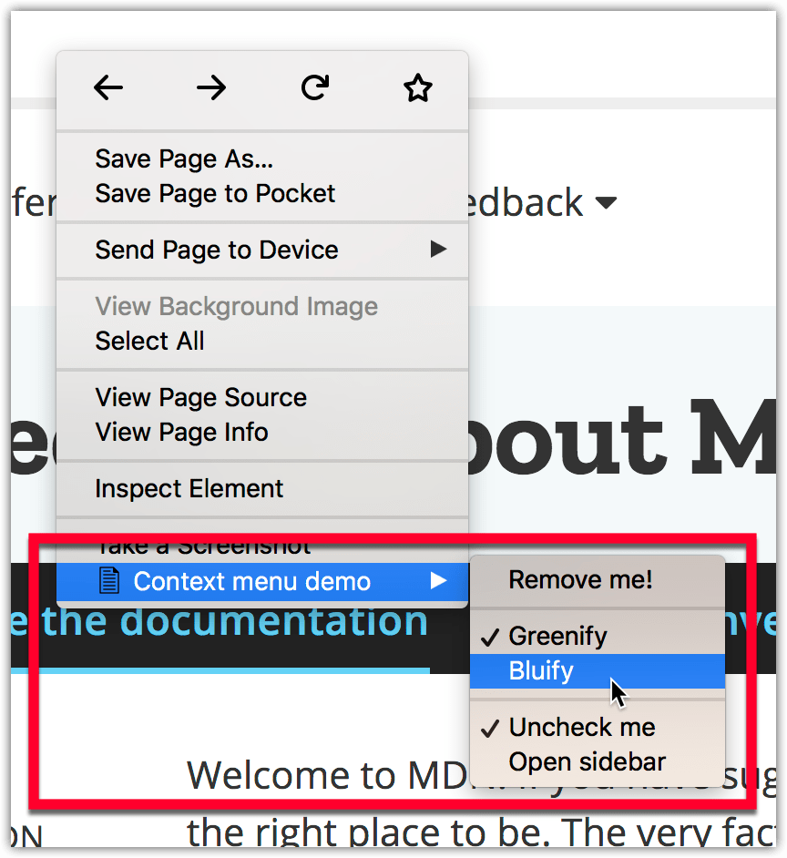
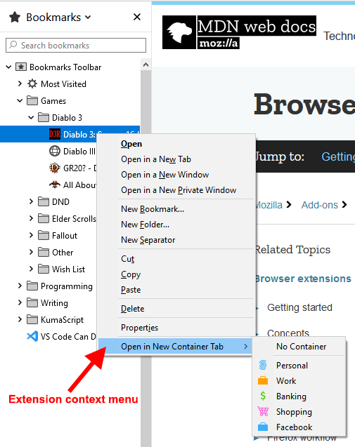
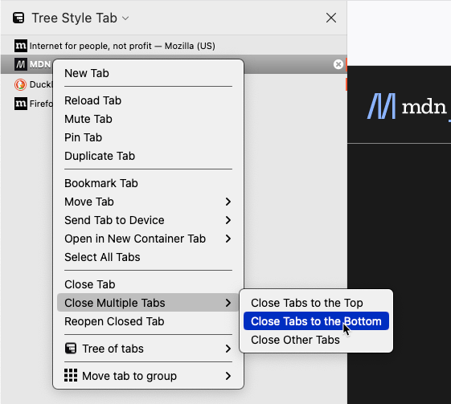

This user interface option adds one or more items to a browser context menu. This is the menu available when a user right-clicks on a web page. Tabs and bookmarks can also have context menus, available through the {{WebExtAPIRef("menus")}} API.



You use this option to expose features relevant to specific browser or web page contexts. For example, you can show features to open a graphic editor when the user clicks on an image or offer a feature to save page content when part of a page is selected. You can add plain menu items, checkbox items, radio button groups, and separators to menus. Once a context menu item has been added using {{WebExtAPIRef("menus.create")}} it's displayed in all browser tabs, but you can hide it by removing it with {{WebExtAPIRef("menus.remove")}}.

The full list of supported contexts is available at {{WebExtAPIRef("menus.ContextType")}} and includes contexts outside of a web page, such as bookmark items in the browser UI. For example, the "[Open bookmark in Container Tab](https://github.com/Rob--W/bookmark-container-tab)" extension adds a menu item that allows the user to open a bookmark URL in a new container tab.



You can also override the context menus displayed in extension pages, such as custom sidebars and popups, to use either the tab or bookmark context menus instead of the default context menu, with {{WebExtAPIRef("menus.overrideContext")}}. This is a helpful method when your extension provides a custom presentation of tabs or bookmarks. The menu automatically includes menu items for any other extensions that have defined tab or bookmark context menu items. You can choose whether to include the default context menu items. Hiding the default items gives the extension complete control over the items displayed in the rendered native context menu, as shown in the image below for the Tree Style Tab extension.



## Specifying context menu items

You manage context menu items programmatically, using the {{WebExtAPIRef("contextMenus")}} API. However, you need to request the `contextMenus` permission in your manifest.json to be able to take advantage of the API.

```json
"permissions": ["contextMenus"]
```

You can then add (and update or delete) the context menu items in your extension's background script. To create a menu item you specify an id, its title, and the context menus it should appear on:

```js
browser.contextMenus.create(
  {
    id: "log-selection",
    title: browser.i18n.getMessage("contextMenuItemSelectionLogger"),
    contexts: ["selection"],
  },
  onCreated,
);
```

Your extension then listens for clicks on the menu items. The passed information about the item clicked, the context where the click happened, and details of the tab where the click took place can then be used to invoke the appropriate extension functionality.

```js
browser.contextMenus.onClicked.addListener((info, tab) => {
  switch (info.menuItemId) {
    case "log-selection":
      console.log(info.selectionText);
      break;
    // …
  }
});
```

## Icons

For details on how to create icons to use with your context menu, see [Iconography](https://acorn.firefox.com/latest/styles/iconography-q7JqGl5H) in the [Acorn Design System](https://acorn.firefox.com/latest) documentation.

## Examples

The [webextensions-examples](https://github.com/mdn/webextensions-examples) repository on GitHub contains two examples of extensions that implement context menu items:

- [menu-demo](https://github.com/mdn/webextensions-examples/tree/main/menu-demo) adds several items to the browser's context menu.
- [context-menu-copy-link-with-types](https://github.com/mdn/webextensions-examples/tree/main/context-menu-copy-link-with-types) adds a context menu item to links that copies the link URL to the clipboard, as plain text and rich HTML.
